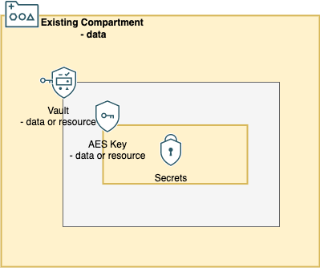

# Oracle Cloud Foundation Terraform Module - secret - quickly create OCI secrets and the underlying vault resources if necessary


## Table of Contents
1. [Overview](#overview)
1. [Deliverables](#deliverables)
1. [Architecture](#Architecture-Diagram)
1. [Executing Instructions](#instructions)
1. [Documentation](#documentation)
1. [The Team](#team)
1. [Feedback](#feedback)
1. [Known Issues](#known-issues)


## <a name="overview"></a>Overview
This module allows you to quickly create OCI secrets by just passing in the data in a simple and flexibe json format. It will handle the data encoding for you and also create a vault and AES key if required. It will also create new secret versions whenever the secret contents change.


## <a name="deliverables"></a>Deliverables
This folder contains several deliverables:
- A terraform child module that creates the secret and vault resources
- an example parent module that uses the child module to create secrets. 
    - three secret content types are shown: string, list, and map
    - vault and key options are also shown: provide an existing vault and key or omit and they will be created
    - ability to pass in one or multiple secrets into the same module is also shown


## <a name="architecture"></a>Architecture-Diagram
<brief introduction to arch diagram. update link to where your image lives. default is in the documentation folder>



## <a name="instructions"></a>Executing Instructions

## Prerequisites
The executor of this stack will need manage permissions and quotas to create secrets. They will also need manage access to create vaults and keys if they do not use an existing vault and key. Otherwise they will need use access to vaults and keys

## Deployment
This module is a child module and can't be run directly. It needs a parent module to call this module to run. See the examples folder for example parent modules that call this submodule

### source type
github url with path and git tag is recommended for production code. local path is used for sub-module development and customization
- github url - make sure to update the version tag to latest stable git tag version for initial deployment. If already deployed and you want to update the version, you need to validate that the new child module version works with your codebase and doesn't create dangerous resource changes, deletions, or creations
```
    source = "github.com/oracle-devrel/terraform-oci-oracle-cloud-foundation//cloud-foundation/modules/cloud-foundation-library/secret/module?ref=<input latest git tag>"
```
- local path - this should be used if you are customizing the module. The actual path will need to be updated to where your child module resides relative to your parent module.
```
    source = "../../module"
```

## Resources Created

The "compartment" variable takes in a compartment ocid and is used to determine what compartment to create the resources in. If you are using an existing vault and/or key, your secret should live in the same compartment.

### Vault
The "existing_vault" variable takes in an optional ocid of an existing vault. If none is provided, a new vault will be created using the "vault_name" and "vault_type" variables. The vault name should be customized to make logical sense to your company. The vault type defaults to the DEFAULT vault type. If stronger isolation is required, you can also use the VIRTUAL_PRIVATE vault type.

### Key
The "existing_AES_key" variable takes in an optional ocid of an existing vault. If none is provided, a new key is created using the "AES_key_name" and "AES_key_length" variabes. The default key length is 32 Bytes (256 bits). Shorter keys with 16 Bytes (128 bits ) or 24 Bytes (192 bits) are available. 

If an existing key is provided, the vault it lives in must also be specified with the "existing_vault" variable. However, you can specify a new key in an existing vault or a new vault.

### Secret
The "secrets" variable is a map of a custom secret object. Each entry in the map will create a secret. The keys in the map will be the names used for the secret and also used as the key in the secrets output variabe. The values of the map are a custom object with two fields currently. The "contents" field should contain the data you want encrypted in the secret. The "description" field should contain helpful information that does not need to be encrypted like what the secret contains or how to use it.

Note: while the contents field accepts any valid terraform variable type including complex types, the same type is required for each module call. I.E. creating two secrets with different content formats (string and list) requires two module calls


## <a name="documentation"></a>Documentation

<link to official oci documentation for the resources you create>

[Vault Overview](https://docs.oracle.com/en-us/iaas/Content/KeyManagement/Concepts/keyoverview.htm)

## <a name="team"></a>The Team
- **Owners**: [JB Anderson](https://github.com/JBAnderson5)

## <a name="feedback"></a>Feedback
We welcome your feedback. To post feedback, submit feature ideas or report bugs, please use the Issues section on this repository.	

## <a name="known-issues"></a>Known Issues
**At the moment, there are no known issues**

ORACLE AND ITS AFFILIATES DO NOT PROVIDE ANY WARRANTY WHATSOEVER, EXPRESS OR IMPLIED, FOR ANY SOFTWARE, MATERIAL OR CONTENT OF ANY KIND CONTAINED OR PRODUCED WITHIN THIS REPOSITORY, AND IN PARTICULAR SPECIFICALLY DISCLAIM ANY AND ALL IMPLIED WARRANTIES OF TITLE, NON-INFRINGEMENT, MERCHANTABILITY, AND FITNESS FOR A PARTICULAR PURPOSE. FURTHERMORE, ORACLE AND ITS AFFILIATES DO NOT REPRESENT THAT ANY CUSTOMARY SECURITY REVIEW HAS BEEN PERFORMED WITH RESPECT TO ANY SOFTWARE, MATERIAL OR CONTENT CONTAINED OR PRODUCED WITHIN THIS REPOSITORY. IN ADDITION, AND WITHOUT LIMITING THE FOREGOING, THIRD PARTIES MAY HAVE POSTED SOFTWARE, MATERIAL OR CONTENT TO THIS REPOSITORY WITHOUT ANY REVIEW. USE AT YOUR OWN RISK.