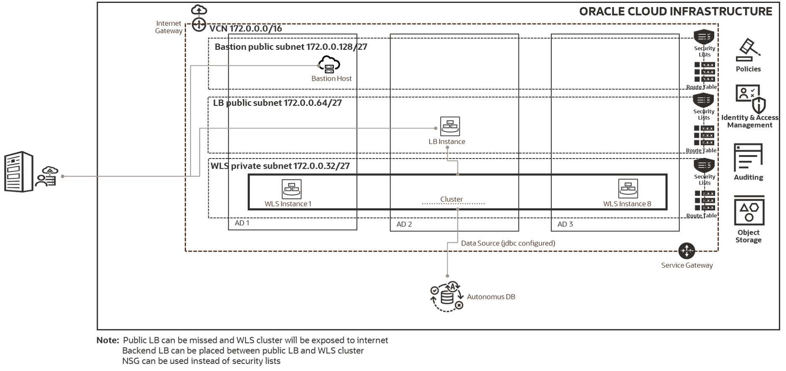

Terraform
-----------------------

OCI Terraform Provider Configuration on Linux and Windows machine -- https://mosemp.us.oracle.com/epmos/faces/DocumentDisplay?_afrLoop=101338705018173&id=2470410.1

Scope
-------

This solution creates single/multi node WLS cluster with ATP DB as INFRA DB optionally fronted by a load balancer. 

Solution architecture

Tenancy Authentication Pre-requisites
--------------------

The terraform OCI provider supports API Key based authentication and Instance Principal based authentication.

User needs an OCI account in the tenancy. Here are the authentication information required 
for invocation of Terraform scripts. 

**Tenancy OCID** - The global identifier for your account, always shown on the bottom of the web console.

**User OCID** - The identifier of the user account you will be using for Terraform

**Fingerprint** - The fingerprint of the public key added in the above user's API Keys section of the web console. 

**Private key path** - The path to the private key stored on your computer. The public key portion must be added to the user account above in the API Keys section of the web console. 

How to get required keys and ocids -- https://docs.cloud.oracle.com/en-us/iaas/Content/API/Concepts/apisigningkey.htm 

Cloud Foundation Pre-requisites
-----------------------------------------

**Network information**

* Existing Compartment OCID for Weblogic and ATP Database
* Existing VCN
* Loadbalancer Frontend Public Subnet
* Loadbalancer Backend Public Subnet (optional)
* WLS Private Subnet
* Management Public Subnet (for bastion host, uses the same AD as WLS) 
* Security Lists and Route Tables created (User will need to open the port 22 for bastion IP/subnet CIDR.)

**Policies**

* Security policy for accessing vault
* Policy for managing ATP
* Policy for management of the cluster
* Policy for accesing the creation of compute nodes and block volumes

**Instance**

* Bastion Instance created

-> For detailed information about prerequisites, please read Prerequisites instructions file.

Inputs
-------------

* **terraform.tfvars** - Add corresponding environment values to terraform.tfvars file.

* **main.tf** - is where we call the modules in order as defined in ../modules.
* **outputs.tf** - result printed on the stdout at the completion of terraform provisioning.
* **provider.tf** - oci provider is defined.
* **variables.tf** - defines the variables that are passed to modules as input.

Invoking Terraform
--------------------

### Initialize the terraform provider plugin
$ terraform init

### Invoke apply on terraform using terraform.tfvars file
$ terraform apply

**WLS Non JRF:**
Variable *create_atp_db* should be false and *atp_db_password_ocid* and *atp_db_compartment_id* should not be provided.

**WLS JRF with ATP DB:**
$ terraform apply -var-file=terraform.tfvars
Variable *create_atp_db* should be true and *atp_db_password_ocid* and *atp_db_compartment_id* should be provided.

**Creating Multiple instances from same solutions:**
$ terraform apply -var-file=terraform.tfvars -state=<use unique dir or state file name for each stack>

### To destroy the infrastructure

**WLS Non JRF:**
$ terraform destroy -var-file=terraform.tfvars 

**WLS JRF with ATP DB:**
$ terraform destroy -var-file=terraform.tfvars

Inputs
-------------

* **Inputs to terraform:**
    *  User will provide the following as param to terraform:
        * #### OCI authentication

            Tenancy Ocid
            
            User Ocid
            
            Fingerprint
            
            Private Key Path
            
            Region
        
          #### Network Information

            Compartment Ocid for WebLogic 12C
            
            Network Compartment Id
            
            Existing Vcn Id
            
            Wls Subnet Id
            
            Add Load Balancer (true or false)
            
            LB Subnet Id
            
            Existing Bastion Instance Id (true or false)
            
            Bastion Host

          #### Service Name

            Service Name (identifier for your project)

          #### Weblogic

            Instance Image Id

            Instance Shape

            Wls Admin User

            Wls Admin Password Ocid

            Use Regional Subnet (true or false)

            Wls Version

            Wls Node Count

          # Keys  

            Ssh Public Key

            Bastion Ssh Private Key

          # ATP DB - JRF Domain

            Create Atp DB (true (JRF) or false (non-JRF) )

            Atp DB Level

            Atp DB Password Ocid (provided only when with JRF)

            Atp DB Compartment Id (provided only when with JRF)

            Autonomous Database Cpu Core Count

            Autonomous Database DB Name

            Autonomous Database Admin Password

            Autonomous Database Data Storage Size in Tbs
            
            Atp DB Id (provided only when ATP already exists)

* **Inputs into project**

      # SSH Private Key file 
        User will use ssh private bastion key to connect to Bastion Instance for provisioning WLS 12C. The api private key file will be added to root terraform directory.

      # Version of Marketplace WLS Image id if not used custom one
        Add marketplace image version in version.txt file.
      
      # Change bootstrap
        If custom image is used, change bootstrap file from weblogic/instance/userdata - to run the WLST scripts from your image.
    

           
